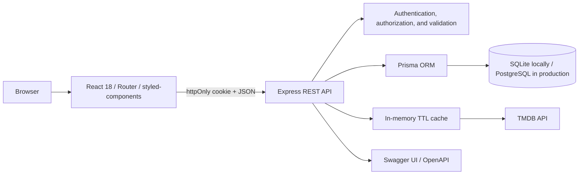

<div align="center">

#  MovieHub

Discover, rate, organize, and share the movies that become part of your story.

<p>
  
  
  
  
  
</p>

A full-stack movie platform with discovery, accounts, favorites, custom lists, reviews, ratings, recommendations, and moderation tools.

</div>

---

## Academic and AI disclosure

> **MovieHub was created 100% with artificial intelligence as a school project.**

The purpose of the project was to observe and understand how AI systems plan, design, code, and structure a complete website. It serves as an academic experiment in AI-assisted web development, from the interface and user experience to the API, database, tests, and documentation.

MovieHub should therefore be read as both a functional application and a study of how artificial intelligence approaches full-stack product development.

## About MovieHub

MovieHub is a responsive platform for discovering, rating, and organizing movies. Catalog data comes from TMDB through a secure backend proxy, while accounts, favorites, lists, comments, likes, ratings, and profiles are stored in the application database.

The project grew from a simple React interface into a complete full-stack application while preserving its dark, cinematic visual identity.

## Highlights

- Popular, top-rated, upcoming, now-playing, and genre-based discovery
- Advanced search with suggestions, debounce, local history, filters, and pagination
- Movie details, cast, directors, trailers, recommendations, and similar titles
- Registration, login, persistent `httpOnly` sessions, logout, and public profiles
- Per-user favorites and custom lists with ordering and shareable public links
- Editable comments, likes, community ratings, and moderation
- Personalized recommendations based on user activity
- Admin dashboard with metrics and account controls
- OpenAPI documentation at `/api/docs`
- API integration tests and frontend component tests

## Architecture



The browser never receives the TMDB key. External catalog requests pass through `server/src/services/tmdbService.js`, which applies timeouts, normalization, language settings, and caching.

## Technology

| Area | Technology |
| --- | --- |
| Frontend | React 18, React Router, styled-components, Context API, Axios |
| Backend | Node.js, Express, JWT, bcrypt, Zod, Helmet, rate limiting |
| Database | Prisma, SQLite for development, PostgreSQL for production |
| Movie data | TMDB API |
| Documentation | Swagger UI and OpenAPI |
| Testing | Jest, Supertest, and Testing Library |

## Project structure

```text
moviehub/
├── client/
│   ├── public/
│   └── src/
│       ├── components/
│       ├── contexts/
│       ├── hooks/
│       ├── pages/
│       ├── services/
│       ├── styles/
│       └── utils/
├── server/
│   ├── prisma/
│   │   ├── migrations/          # SQLite
│   │   ├── postgresql/          # production schema and migrations
│   │   ├── schema.prisma
│   │   └── seed.js
│   ├── src/
│   │   ├── controllers/
│   │   ├── docs/
│   │   ├── middlewares/
│   │   ├── routes/
│   │   ├── services/
│   │   ├── utils/
│   │   └── validators/
│   └── tests/
├── package.json
└── README.md
```

## Run locally

### Requirements

- Node.js 18.18 or newer
- npm 9 or newer
- A [TMDB API key](https://www.themoviedb.org/settings/api)
- PostgreSQL for production only; SQLite is enough for local development

### Installation

```bash
git clone https://github.com/Lime4idan/api-filme-react.git
cd api-filme-react
npm install
```

The root package uses npm workspaces, so one installation prepares the client, server, and shared tooling.

### Environment variables

Create `server/.env` from `server/.env.example`:

```env
PORT=5055
DATABASE_URL="file:./dev.db"
JWT_SECRET=replace-with-a-random-string-at-least-32-characters-long
JWT_EXPIRES_IN=7d
TMDB_API_KEY=your_tmdb_key
CLIENT_URL=http://localhost:3000
NODE_ENV=development
DEMO_ADMIN_EMAIL=admin@moviehub.local
DEMO_ADMIN_PASSWORD=
DEMO_USER_EMAIL=user@moviehub.local
DEMO_USER_PASSWORD=
```

Create `client/.env` from `client/.env.example`:

```env
REACT_APP_API_URL=http://localhost:5055/api
```

Never expose the TMDB key through a `REACT_APP_*` variable, because those values become part of the browser bundle. Real `.env` files are ignored by Git.

### Prepare the database

```bash
npm run prisma:generate
npm run prisma:migrate
npm run prisma:seed
```

The seed refuses default passwords when `NODE_ENV=production`.

### Start the application

```bash
npm run dev
```

| Service | Local address |
| --- | --- |
| Frontend | `http://localhost:3000` |
| REST API | `http://localhost:5055/api` |
| API documentation | `http://localhost:5055/api/docs` |
| Health check | `http://localhost:5055/api/health` |

## Main frontend routes

| Route | Access | Purpose |
| --- | --- | --- |
| `/` | Public | Featured title and discovery rails |
| `/filme/:id` | Public | Details, trailer, and community activity |
| `/categoria/:genreId` | Public | Catalog by genre |
| `/melhores-avaliados` | Public | Top-rated movies |
| `/lancamentos` | Public | Upcoming releases |
| `/em-cartaz` | Public | Movies currently in theaters |
| `/pesquisa?query=&page=` | Public | Search and synchronized filters |
| `/login` / `/cadastro` | Guest | Authentication |
| `/perfil` | Private | Profile and password management |
| `/minha-lista` | Private | Favorites |
| `/listas` / `/listas/:id` | Private | Custom lists |
| `/lista/:shareCode` | Public | Shared list |
| `/usuario/:id` | Public | Public profile without email |
| `/admin` | Admin | Metrics and moderation |

## Core API groups

- Authentication and profiles: `/api/auth/*`, `/api/profile`, `/api/users/:id`
- TMDB and discovery: `/api/movies/*`, `/api/recommendations/personalized`
- Favorites and lists: `/api/favorites`, `/api/lists/*`, `/api/public/lists/:shareCode`
- Comments and ratings: `/api/movies/:id/comments`, `/api/comments/*`, `/api/movies/:id/rating`
- Administration: `/api/admin/*`

All errors follow a consistent JSON envelope with `code`, `message`, and optional `details` fields. The complete contract is available through Swagger UI.

## Screenshots

Screenshots should be captured from a local instance connected to a valid TMDB key. Recommended views are the home page, movie details, search, custom lists, and the admin dashboard.

## Project status

**Status:** Functional academic project  
**Purpose:** Study how artificial intelligence designs and implements a full-stack website  
**AI usage:** 100% AI-built

---

<div align="center">

### 🍿 Every movie leaves a trace. MovieHub helps you keep it.

</div>
