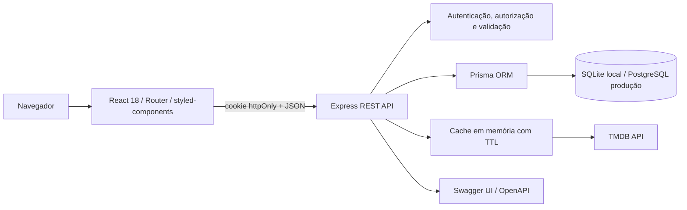

# MovieHub

MovieHub é uma plataforma full-stack para descobrir, avaliar e organizar filmes. O catálogo e os metadados vêm do TMDB por meio de um proxy seguro no backend; contas, favoritos, listas, comentários, curtidas, avaliações e perfis são persistidos no banco da aplicação.

O projeto nasceu de uma interface React simples e preserva sua identidade cinematográfica escura em azul-marinho e roxo, agora com uma experiência responsiva, estados completos e uma arquitetura pronta para produção.

## Visão geral

- Descoberta por populares, melhores avaliados, lançamentos, em cartaz e gêneros;
- pesquisa avançada com sugestões, debounce de 500 ms, histórico local, filtros e paginação;
- detalhes completos, elenco, direção, trailer, recomendações e similares;
- cadastro, login, sessão persistente em cookie `httpOnly`, logout e perfis;
- favoritos privados por usuário;
- listas personalizadas, reordenação e compartilhamento por código público;
- comentários editáveis, curtidas e moderação;
- avaliações de 1 a 10 e média da comunidade;
- recomendações simples baseadas no histórico do usuário;
- painel administrativo com indicadores, moderação e desativação de contas;
- documentação OpenAPI em `/api/docs`;
- testes de integração da API e testes de componentes/fluxos críticos do frontend.

## Screenshots

As capturas devem ser produzidas com a aplicação local conectada a uma chave TMDB válida, para que o README nunca apresente conteúdo simulado. Use as telas `/`, `/filme/:id` e `/listas` como conjunto recomendado e salve os arquivos em `docs/screenshots/`.

## Arquitetura



O frontend nunca recebe a chave do TMDB. Toda chamada externa passa por `server/src/services/tmdbService.js`, que aplica idioma `pt-BR`, timeout, normalização e cache.

## Tecnologias

**Frontend:** React 18, React Router DOM, styled-components, Context API, Axios, Lucide Icons e Testing Library.

**Backend:** Node.js, Express, Prisma ORM, JWT, bcrypt, Zod, Helmet, CORS, express-rate-limit, Swagger UI e Jest/Supertest.

**Banco:** SQLite no desenvolvimento local e schema/migrações separados para PostgreSQL em produção.

## Estrutura

```text
moviehub/
├── client/
│   ├── public/
│   └── src/
│       ├── components/
│       ├── contexts/
│       ├── hooks/
│       ├── pages/
│       ├── services/
│       ├── styles/
│       └── utils/
├── server/
│   ├── prisma/
│   │   ├── migrations/          # SQLite
│   │   ├── postgresql/          # schema e migrations de produção
│   │   ├── schema.prisma
│   │   └── seed.js
│   ├── src/
│   │   ├── controllers/
│   │   ├── docs/
│   │   ├── middlewares/
│   │   ├── routes/
│   │   ├── services/
│   │   ├── utils/
│   │   └── validators/
│   └── tests/
├── package.json
└── README.md
```

## Requisitos

- Node.js 18.18 ou superior;
- npm 9 ou superior;
- chave de API do [TMDB](https://www.themoviedb.org/settings/api);
- PostgreSQL apenas para produção. SQLite já é suficiente para desenvolvimento e testes.

## Instalação

```bash
git clone https://github.com/Lime4idan/api-filme-react.git
cd api-filme-react
npm install
```

O projeto usa npm workspaces, portanto o comando na raiz instala cliente, servidor e ferramentas compartilhadas.

### Variáveis de ambiente

Crie `server/.env` a partir de `server/.env.example`:

```env
PORT=5055
DATABASE_URL="file:./dev.db"
JWT_SECRET=uma-chave-aleatoria-com-no-minimo-32-caracteres
JWT_EXPIRES_IN=7d
TMDB_API_KEY=sua_chave_do_tmdb
CLIENT_URL=http://localhost:3000
NODE_ENV=development
DEMO_ADMIN_EMAIL=admin@moviehub.local
DEMO_ADMIN_PASSWORD=
DEMO_USER_EMAIL=usuario@moviehub.local
DEMO_USER_PASSWORD=
```

Crie `client/.env` a partir de `client/.env.example`:

```env
REACT_APP_API_URL=http://localhost:5055/api
```

Não use `REACT_APP_KEY`: chaves com esse prefixo entram no bundle do navegador. Arquivos `.env` estão ignorados pelo Git.

### Banco local e seed

```bash
npm run prisma:generate
npm run prisma:migrate
npm run prisma:seed
```

`prisma:migrate` aplica migrações existentes sem prompts, inclusive em CI. Ao criar uma nova migração durante o desenvolvimento, use `npm run prisma:migrate:dev -- --name nome_da_migracao`.

Em desenvolvimento, se as senhas do seed não forem definidas, são usadas somente localmente:

- `admin@moviehub.local` / `MovieHubAdmin123!`
- `usuario@moviehub.local` / `MovieHubUser123!`

O seed recusa senhas padrão quando `NODE_ENV=production`.

### Executar

```bash
npm run dev
```

- Frontend: `http://localhost:3000`
- API: `http://localhost:5055/api`
- Documentação: `http://localhost:5055/api/docs`
- Saúde: `http://localhost:5055/api/health`

## Rotas do frontend

| Rota | Acesso | Finalidade |
| --- | --- | --- |
| `/` | Público | Destaque e trilhos de descoberta |
| `/filme/:id` | Público | Detalhes, trailer e comunidade |
| `/categoria/:genreId` | Público | Catálogo por gênero |
| `/melhores-avaliados` | Público | Filmes aclamados |
| `/lancamentos` | Público | Próximas estreias |
| `/em-cartaz` | Público | Filmes em exibição |
| `/pesquisa?query=&page=` | Público | Pesquisa e filtros sincronizados com URL |
| `/login` / `/cadastro` | Visitante | Autenticação |
| `/perfil` | Privado | Perfil e alteração de senha |
| `/minha-lista` | Privado | Favoritos |
| `/listas` / `/listas/:id` | Privado | Listas personalizadas |
| `/lista/:shareCode` | Público | Lista compartilhada |
| `/usuario/:id` | Público | Perfil sem e-mail |
| `/admin` | Admin | Indicadores e moderação |
| `/404` | Público | Página não encontrada |

## API REST

Todos os erros seguem o formato:

```json
{
  "error": {
    "code": "VALIDATION_ERROR",
    "message": "Dados inválidos",
    "details": []
  }
}
```

### Autenticação e usuários

```text
POST /api/auth/register
POST /api/auth/login
GET  /api/auth/me
POST /api/auth/logout
GET  /api/profile
PUT  /api/profile
PUT  /api/profile/password
GET  /api/users/:id
```

### TMDB e descoberta

```text
GET /api/movies/popular
GET /api/movies/top-rated
GET /api/movies/upcoming
GET /api/movies/now-playing
GET /api/movies/search
GET /api/movies/genres
GET /api/movies/discover
GET /api/movies/:id
GET /api/movies/:id/credits
GET /api/movies/:id/videos
GET /api/movies/:id/recommendations
GET /api/movies/:id/similar
GET /api/recommendations/personalized
```

### Favoritos, listas e compartilhamento

```text
GET    /api/favorites
POST   /api/favorites
DELETE /api/favorites/:tmdbMovieId
GET    /api/favorites/check/:tmdbMovieId

GET    /api/lists
POST   /api/lists
GET    /api/lists/:id
PUT    /api/lists/:id
DELETE /api/lists/:id
POST   /api/lists/:id/items
DELETE /api/lists/:id/items/:tmdbMovieId
PUT    /api/lists/:id/reorder
GET    /api/public/lists/:shareCode
```

### Comentários e avaliações

```text
GET    /api/movies/:tmdbMovieId/comments
POST   /api/movies/:tmdbMovieId/comments
PUT    /api/comments/:id
DELETE /api/comments/:id
POST   /api/comments/:id/like
DELETE /api/comments/:id/like

GET    /api/movies/:tmdbMovieId/ratings
GET    /api/movies/:tmdbMovieId/my-rating
POST   /api/movies/:tmdbMovieId/rating
DELETE /api/movies/:tmdbMovieId/rating
```

### Administração

```text
GET    /api/admin/dashboard
DELETE /api/admin/comments/:id
PUT    /api/admin/users/:id/status
```

## Modelos do banco

- `User`: conta, perfil, papel `USER`/`ADMIN` e estado ativo;
- `Favorite`: filme salvo por usuário, único por `userId + tmdbMovieId`;
- `MovieList`: lista privada/pública com `shareCode` único;
- `MovieListItem`: filme ordenado, único por lista;
- `Comment`: comentário com autoria e timestamps;
- `Rating`: nota única por usuário e filme;
- `CommentLike`: curtida única por usuário e comentário.

Todas as relações de conteúdo usam exclusão em cascata. A API nunca aceita `userId` para operações privadas: a identidade vem exclusivamente da sessão verificada.

## Cache do TMDB

| Conteúdo | TTL |
| --- | ---: |
| Gêneros | 24 horas |
| Detalhes, créditos e vídeos | 30 minutos |
| Populares, aclamados e descoberta | 10 minutos |
| Pesquisas | 5 minutos |

O cache é em memória, simples e adequado a uma única instância. Em implantação horizontal, use Redis para compartilhar entradas.

## Testes e build

```bash
npm test
npm run build
```

Os testes do servidor criam `server/prisma/test.db`, executam o schema e validam cadastro, login, sessão, rota protegida, favoritos, listas, autorização, comentários, curtidas e avaliações. O frontend cobre login, card, rota protegida, pesquisa e favorito.

## PostgreSQL e deploy

Para produção, use o schema e as migrações de `server/prisma/postgresql`:

```bash
cd server
DATABASE_URL="postgresql://..." npm run prisma:deploy
npm start
```

Configuração recomendada:

- frontend: Vercel ou Netlify, com build `npm run build --workspace client` e diretório `client/build`;
- backend: Render ou Railway, com build `npm install && npm run prisma:deploy --workspace server`;
- banco: Neon, Supabase PostgreSQL ou Railway PostgreSQL;
- defina `CLIENT_URL` com a origem HTTPS exata do frontend. Mais de uma origem pode ser informada separada por vírgula;
- defina `REACT_APP_API_URL` antes do build do frontend;
- mantenha `NODE_ENV=production`, um `JWT_SECRET` forte e a chave do TMDB apenas no backend;
- configure o host do frontend para redirecionar rotas desconhecidas a `index.html` (fallback de SPA).

## Segurança

- senha com bcrypt e custo 12;
- JWT com expiração, cookie `httpOnly`, `sameSite` e `secure` em produção;
- Bearer JWT aceito para clientes não navegadores;
- Helmet, CORS por allowlist, rate limiting e body limitado a 100 KB;
- Zod em entradas sensíveis e parâmetros privados;
- autorização no backend para dono e administrador;
- mensagens genéricas no login e sem `passwordHash` nas respostas;
- erros centralizados, sem stack trace em produção;
- listas privadas nunca são resolvidas pela rota pública.

## Limitações conhecidas

- a pesquisa avançada do TMDB combina e filtra até as cinco primeiras páginas de correspondências para manter latência previsível;
- o cache em memória é reiniciado com o processo e não é compartilhado entre instâncias;
- comentários e contagens são atualizados por requisição, sem WebSocket;
- o MovieHub organiza e descobre conteúdo; ele não hospeda nem reproduz filmes.

## Créditos

Este produto usa a API do TMDB, mas não é endossado nem certificado pelo TMDB. Dados e imagens pertencem aos respectivos detentores.
