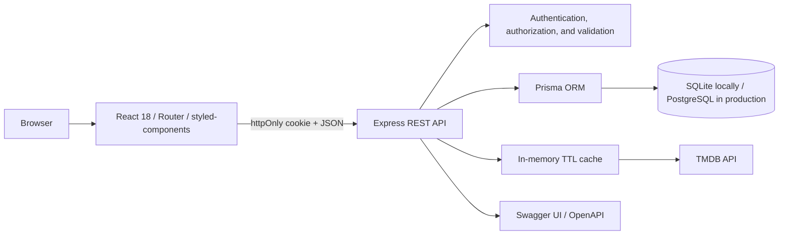

# MovieHub

MovieHub is a full-stack platform for discovering, rating, and organizing movies. Catalog data comes from TMDB through a secure backend proxy, while accounts, favorites, lists, comments, likes, ratings, and profiles are stored in the application database.

The project evolved from a simple React interface into a responsive, production-oriented application while preserving its dark navy-and-purple cinematic identity.

## Highlights

- Popular, top-rated, upcoming, now-playing, and genre-based discovery
- Advanced search with suggestions, a 500 ms debounce, local history, filters, and pagination
- Movie details, cast, directors, trailers, recommendations, and similar titles
- Registration, login, persistent `httpOnly` cookie sessions, logout, and profiles
- Per-user favorites and custom lists with ordering and public share codes
- Editable comments, likes, moderation, and community ratings
- Personalized recommendations based on viewing activity
- Admin dashboard with metrics, moderation, and account controls
- OpenAPI documentation at `/api/docs`
- API integration tests and frontend component/critical-flow tests

## Screenshots

Screenshots should be captured from a local instance connected to a valid TMDB key so this README never presents mock catalog data. Recommended screens are `/`, `/filme/:id`, and `/listas`; save them under `docs/screenshots/`.

## Architecture



The browser never receives the TMDB key. Every external request passes through `server/src/services/tmdbService.js`, which applies timeouts, normalization, and caching.

## Stack

**Frontend:** React 18, React Router DOM, styled-components, Context API, Axios, Lucide Icons, and Testing Library.

**Backend:** Node.js, Express, Prisma ORM, JWT, bcrypt, Zod, Helmet, CORS, express-rate-limit, Swagger UI, and Jest/Supertest.

**Database:** SQLite for local development, with a separate PostgreSQL schema and migrations for production.

## Project structure

```text
moviehub/
├── client/
│   ├── public/
│   └── src/
│       ├── components/
│       ├── contexts/
│       ├── hooks/
│       ├── pages/
│       ├── services/
│       ├── styles/
│       └── utils/
├── server/
│   ├── prisma/
│   │   ├── migrations/          # SQLite
│   │   ├── postgresql/          # production schema and migrations
│   │   ├── schema.prisma
│   │   └── seed.js
│   ├── src/
│   │   ├── controllers/
│   │   ├── docs/
│   │   ├── middlewares/
│   │   ├── routes/
│   │   ├── services/
│   │   ├── utils/
│   │   └── validators/
│   └── tests/
├── package.json
└── README.md
```

## Requirements

- Node.js 18.18 or newer
- npm 9 or newer
- A [TMDB API key](https://www.themoviedb.org/settings/api)
- PostgreSQL for production only; SQLite is enough for development and tests

## Installation

```bash
git clone https://github.com/Lime4idan/api-filme-react.git
cd api-filme-react
npm install
```

The root package uses npm workspaces, so this command installs the client, server, and shared tooling.

### Environment variables

Create `server/.env` from `server/.env.example`:

```env
PORT=5055
DATABASE_URL="file:./dev.db"
JWT_SECRET=replace-with-a-random-string-at-least-32-characters-long
JWT_EXPIRES_IN=7d
TMDB_API_KEY=your_tmdb_key
CLIENT_URL=http://localhost:3000
NODE_ENV=development
DEMO_ADMIN_EMAIL=admin@moviehub.local
DEMO_ADMIN_PASSWORD=
DEMO_USER_EMAIL=user@moviehub.local
DEMO_USER_PASSWORD=
```

Create `client/.env` from `client/.env.example`:

```env
REACT_APP_API_URL=http://localhost:5055/api
```

Do not use `REACT_APP_KEY`: variables with that prefix become part of the browser bundle. `.env` files are ignored by Git.

### Local database and seed

```bash
npm run prisma:generate
npm run prisma:migrate
npm run prisma:seed
```

`prisma:migrate` applies existing migrations without prompts, including in CI. To create a migration during development, run `npm run prisma:migrate:dev -- --name migration_name`.

The seed refuses default passwords when `NODE_ENV=production`.

### Run

```bash
npm run dev
```

- Frontend: `http://localhost:3000`
- API: `http://localhost:5055/api`
- API documentation: `http://localhost:5055/api/docs`
- Health check: `http://localhost:5055/api/health`

## Main frontend routes

| Route | Access | Purpose |
| --- | --- | --- |
| `/` | Public | Featured title and discovery rails |
| `/filme/:id` | Public | Details, trailer, and community activity |
| `/categoria/:genreId` | Public | Catalog by genre |
| `/melhores-avaliados` | Public | Top-rated movies |
| `/lancamentos` | Public | Upcoming releases |
| `/em-cartaz` | Public | Movies currently in theaters |
| `/pesquisa?query=&page=` | Public | Search and URL-synchronized filters |
| `/login` / `/cadastro` | Guest | Authentication |
| `/perfil` | Private | Profile and password management |
| `/minha-lista` | Private | Favorites |
| `/listas` / `/listas/:id` | Private | Custom lists |
| `/lista/:shareCode` | Public | Shared list |
| `/usuario/:id` | Public | Public profile without email |
| `/admin` | Admin | Metrics and moderation |

## Core API groups

- Authentication and profiles: `/api/auth/*`, `/api/profile`, `/api/users/:id`
- TMDB and discovery: `/api/movies/*`, `/api/recommendations/personalized`
- Favorites and lists: `/api/favorites`, `/api/lists/*`, `/api/public/lists/:shareCode`
- Comments and ratings: `/api/movies/:id/comments`, `/api/comments/*`, `/api/movies/:id/rating`
- Administration: `/api/admin/*`

All errors follow a consistent JSON envelope with `code`, `message`, and optional `details` fields. See `/api/docs` for the complete contract.
